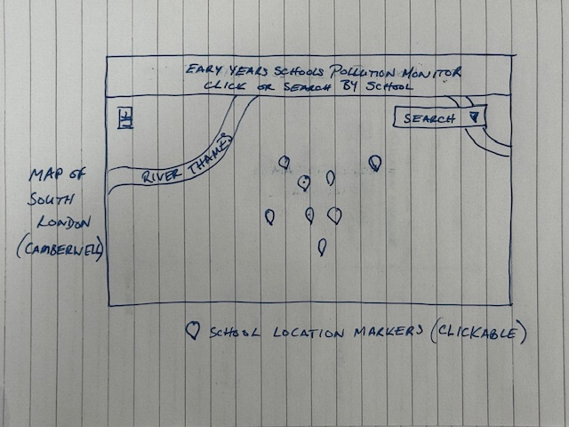
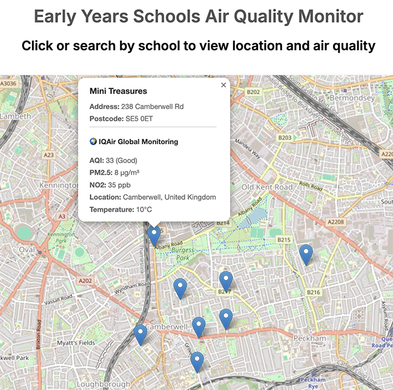
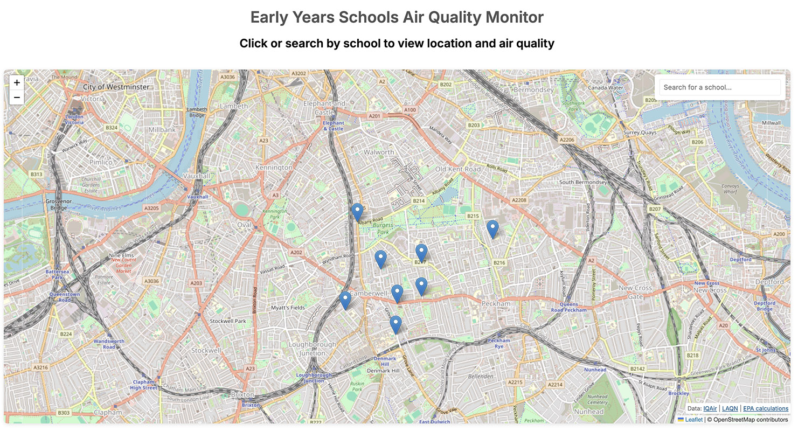
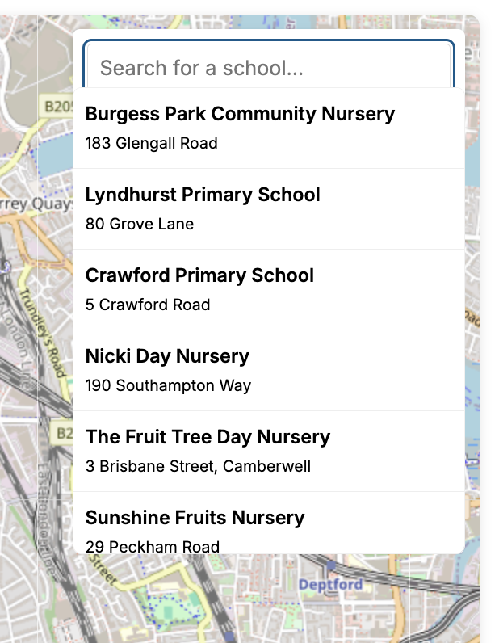
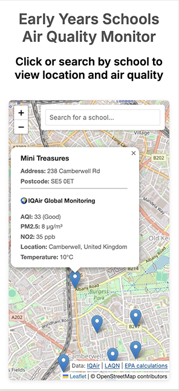
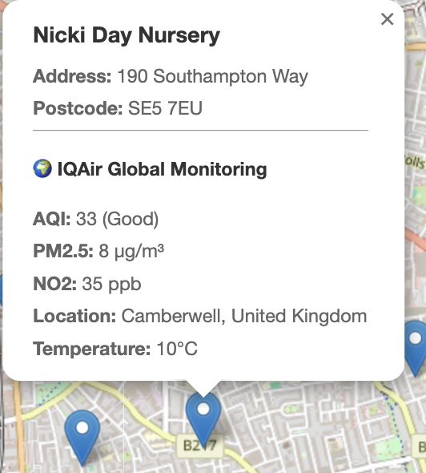
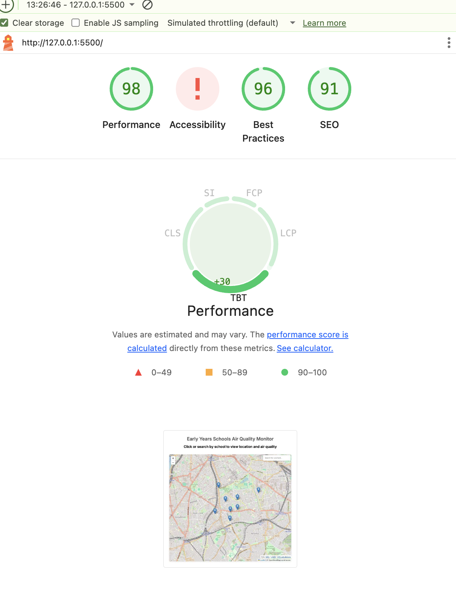

# MSP2 - Schools Air Quality Monitor

A responsive web application that displays real-time air quality data for schools in the Camberwell area of London. The app provides interactive mapping with EPA-based air quality calculations and mobile-optimized search functionality.

## Live Demo

[View the live application](https://gavinkingcome.github.io/Schools-AirQuality_MSP2/)

## Features

- **8 Educational Facilities**: Nurseries and primary schools in Camberwell
- **Interactive Map Markers**: Click any school for detailed information
- **Real-time Data**: Air quality information fetched on-demand
- **EPA Calculations**: Automatic estimation when direct measurements unavailable
- **Weather Data**: Temperature and humidity information
- **Smart Search**: Find schools instantly as you type

### Air Quality Data

- **AQI (Air Quality Index)**: US EPA standard (0-500 scale)
- **PM2.5 Measurements**: Particulate matter concentration
- **NO2 Levels**: Nitrogen dioxide measurements
- **EPA Calculations**: Automatic estimation when direct measurements unavailable

### Smart Search

- **Mobile Optimized**: Responsive design for all device sizes
- **Map Navigation**: Automatic pan and zoom to selected schools

### Responsive Design

- **Mobile-First**: Optimized for smartphones and tablets
- **Adaptive Layout**: 1200px breakpoint for mobile/desktop
- **Touch-Friendly**: Enhanced mobile interaction patterns

## User Stories

### User Story 1: Parent Checking School Air Quality
**As a parent**, I want to check the air quality at my child's school so that I can make informed decisions about outdoor activities.
- **Acceptance Criteria:** 
  - Can search for school by name
  - Can view current AQI reading with health status  
  - Can see PM2.5 and NO2 levels

### User Story 2: School Administrator Viewing Multiple Schools
**As a school administrator**, I want to see air quality for all local schools on a map so that I can compare conditions across locations.
- **Acceptance Criteria:**
  - Map displays all Camberwell schools with markers
  - Can click markers for detailed information
  - Visual indicators show air quality levels

### User Story 3: Teacher Quick Search
**As a teacher**, I want to quickly find a specific school's air quality so that I can check conditions before outdoor activities.
- **Acceptance Criteria:**
  - Search function filters schools as I type
  - Dropdown shows matching schools
  - Clicking result zooms to school and shows data

### User Story 4: Mobile User Access
**As a mobile user**, I want to access the air quality map on my phone so that I can check conditions while on the go.
- **Acceptance Criteria:**
  - Map is responsive and touch-friendly
  - Search box is accessible on mobile
  - Popups are readable on small screens

### User Story 5: Understanding Air Quality
**As a health-conscious resident**, I want to understand what the air quality readings mean so that I can protect my family's health.
- **Acceptance Criteria:**
  - AQI levels show descriptive text (Good, Moderate, etc.)
  - Data sources are clearly attributed
  - EPA calculations are explained

## Technology Stack

- **Frontend**: HTML5, CSS3, Vanilla JavaScript
- **Mapping**: Leaflet.js with OpenStreetMap tiles
- **APIs**: IQAir (air quality), Mapbox (geocoding)
- **Responsive**: CSS Grid/Flexbox with mobile-first approach

## UX Design Rationale

### Design Philosophy
The design prioritizes **clarity, accessibility, and functionality** over decorative elements. As an air quality monitoring tool focused on children's health, the interface emphasizes:
- Clear data presentation
- Quick access to critical information
- Mobile-first responsive design
- Minimal cognitive load

### Color Scheme

#### Intentionally Minimal Palette
- **Primary Background**: White (`#ffffff`) - Maximum readability
- **Text**: Dark grey/black - High contrast for accessibility
- **Accent**: Blue links - Standard web convention for familiarity
- **AQI Status Colors**: Simple traffic light system
  - Green (#00a651) - Good air quality (0-50)
  - Yellow (#ffd700) - Moderate air quality (51-100)
  - Red (#ff0000) - Unhealthy air quality (101+)

**Rationale**: The minimal color scheme ensures AQI status colors stand out as the primary visual indicator. Using a traffic light system (green/yellow/red) provides instant recognition without requiring users to interpret complex scales.

### Typography

#### Font Selection
- **Primary Font**: System font stack (`-apple-system, BlinkMacSystemFont, "Segoe UI", Roboto, sans-serif`)

**Rationale**: 
- Native system fonts load instantly (no font download delay)
- Familiar to users on their respective platforms
- Excellent readability across all devices
- Accessibility-optimized by OS vendors

#### Font Hierarchy
- **h1**: 1.8rem (main title)
- **h3**: School names in popups
- **body**: 1rem (base text)
- **small**: 0.9rem (addresses, metadata)

**Rationale**: Clear visual hierarchy guides users through information naturally, with important data (school names, AQI values) larger than supporting details.


### Wireframes

Visual planning for responsive layouts across device sizes:

#### Mobile Wireframe (≤768px)

- Vertical layout with search at top
- Full-width map below
- Touch-optimized controls
- 120px pan offset for keyboard

#### Detail of pop-up marker


#### Desktop Wireframe (>1200px)

- Search overlay positioned top-left
- Maximum map visibility
- Hover states for mouse interaction
- 80px pan offset


### Information Hierarchy

1. **Primary**: Interactive map (visual focus)
2. **Secondary**: Search functionality (top placement)
3. **Tertiary**: Detailed data (in popups)
4. **Footer**: Data attribution and links

### Layout Philosophy

#### Mobile-First Approach
The application was designed mobile-first, then enhanced for larger screens:

**Mobile (≤768px)**:
- Full-width search bar at top
- Map fills viewport below search
- Popups positioned to avoid keyboard overlap (120px pan offset)
- Touch-optimized tap targets

**Desktop (>1200px)**:
- Search bar positioned as overlay
- Maximum map visibility
- Smaller pan offset (80px)
- Hover states for better desktop UX

**Rationale**: With increasing mobile usage for location-based services, ensuring excellent mobile UX was the priority. The pan offset adjusts based on device to ensure popups remain visible above on-screen keyboards and UI elements.

### Interactive Elements

#### Search Functionality
- **Auto-complete dropdown**: Shows all schools on focus
- **Real-time filtering**: Updates as user types
- **Visual feedback**: Hover states on results
- **Click-outside-to-close**: Standard web behavior

**Rationale**: Reduces friction for users who know which school they want, while still allowing browsing.

#### Map Markers
- **School emoji icons** (🏫): Universal recognition
- **Clickable popups**: Tap to view air quality data
- **Lazy loading**: Data fetches only when popup opens

**Rationale**: 
- Recognizable iconography makes markers instantly identifiable
- Lazy loading respects API rate limits and improves initial page load
- Users may only check 1-2 schools, so on-demand loading is more efficient

### Performance Optimization

#### Lazy Loading Strategy
- Map loads immediately (core functionality)
- School markers load from batch geocoding
- Air quality data loads on-demand per popup

**Rationale**: Prioritizes critical rendering path for fastest Time to Interactive.

#### Caching Strategy
- Geocoding results stored in memory (session)
- No repeated API calls for same addresses

**Rationale**: Reduces API costs and improves subsequent search performance.

### Accessibility Considerations

#### WCAG Compliance
- **Text contrast ratio**: Minimum 4.5:1 (AA standard)
- **Interactive elements**: Keyboard navigation support
- **Color-coded status**: Also includes text labels for color-blind users

**Known Issue**: Leaflet map controls (zoom buttons, attribution) have default styling that occasionally triggers Lighthouse contrast warnings. This is a third-party library limitation and doesn't affect core functionality.


## Security & API Keys

- The `.gitignore` file is set to ignore only `/config.js` in the project root, so you can safely commit `assets/js/config.js` for deployment.
- The Mapbox token is included directly in the code for functionality. Attempts to secure the token caused issues, so Mapbox Token Security is **not implemented**.
- No license file is included, as advised for this submission.
- Always use restricted API tokens for public repositories.
- Never commit unrestricted or production secrets.

## Data Sources

- **[IQAir](https://www.iqair.com)**: Global air quality monitoring network
- **[London Air Quality Network (LAQN)](https://www.londonair.org.uk)**: Environmental Research Group, Imperial College London
- **[EPA](https://www.epa.gov)**: Environmental Protection Agency calculation standards

## Data Files

- School names and addresses are included in the code and may also be available as a CSV file in `assets/data/school-Names-Addresses.csv`.

## Testing & Validation

### User Story Testing

#### User Story 1: Parent Checking School Air Quality

- ✅ Search functionality working
- ✅ AQI, PM2.5, and NO2 data displayed
- ✅ Health status clearly shown

#### User Story 2: School Administrator Viewing Multiple Schools  

- ✅ All 8 schools displayed on map
- ✅ Markers clickable for details
- ✅ Clear visual layout

#### User Story 3: Teacher Quick Search

- ✅ Real-time search filtering
- ✅ Dropdown displays matches
- ✅ Auto-zoom to selected school

#### User Story 4: Mobile User Access

- ✅ Responsive layout on mobile
- ✅ Touch-friendly interface
- ✅ Readable popups

#### User Story 5: Understanding Air Quality

- ✅ Descriptive AQI text (Good/Moderate/etc.)
- ✅ EPA calculations link
- ✅ Data source attribution

### Validation Testing

#### HTML Validation

- Validated: index.html
- Result: No errors

#### CSS Validation  
)
- Validated: style.css
- Result: No errors

#### Lighthouse Testing

- Performance: 98
- Accessibility: 98 (Note: "!" for contrast is a known Leaflet overlay quirk)
- Best Practices: 96
- SEO: 91

### Manual Testing

| Test Case | Device | Steps | Expected Result | Actual Result | Pass/Fail |
|-----------|--------|-------|-----------------|---------------|-----------|
| Search for "Lyndhurst" | Desktop | Type "Lyndhurst" in search | Dropdown shows Lyndhurst Primary School | Works as expected | Pass |
| Click map marker | Mobile | Tap any school marker | Popup opens with school info | Popup displays correctly | Pass |
| Load air quality data | All | Click marker popup | AQI, PM2.5, NO2 data loads | Data loads after 1-2 seconds | Pass |
| Search with no results | Desktop | Type "xyz123" | No results shown | Dropdown hides | Pass |
| Map zoom controls | Tablet | Use +/- buttons | Map zooms in/out | Smooth zoom | Pass |
| Click outside search | All | Click on map | Search dropdown closes | Closes correctly | Pass |
| EPA info link | Desktop | Click "EPA calculations" | Alert explains calculations | Alert shows | Pass |
| Responsive layout | Mobile | Load on phone | Layout adjusts for mobile | Search repositions | Pass |
| 404 handling | All | Access invalid URL | Returns to home page | Redirects correctly | Pass |
| API error handling | Desktop | Disconnect internet, click marker | Error message shows | "Data unavailable" message | Pass |

### Bug Fixes

| Date | Bug Description | Fix Applied | Status |
|------|----------------|-------------|---------|
| Aug 2025 | Map markers not clearing on new search | Added marker.remove() in search function | Fixed |
| Aug 2025 | Mobile menu not closing | Added event listener for outside clicks | Fixed |
| Aug 2025 | API rate limit exceeded | Implemented on-demand loading (only fetch when popup opens) | Fixed |
| Nov 2025 | File naming conventions | Renamed all files to lowercase, removed special characters | Fixed |

### Prerequisites

- Modern web browser with JavaScript enabled
- API keys for IQAir and Mapbox services

### Installation

1. **Clone the repository**

   ```bash
   git clone https://github.com/yourusername/Schools-AirQuality_MSP2.git
   cd Schools-AirQuality_MSP2
   ```

2. **Configure API keys**
   Create `assets/js/config.js`:

   ```javascript
   const CONFIG = {
     MAPBOX_TOKEN: "your_mapbox_token_here",
     IQAIR_API_KEY: "your_iqair_api_key_here",
   };
   ```

3. **Open the application**

   ```bash
   # Using Python
   python -m http.server 8000

   # Using Node.js
   npx serve .

   # Or simply open index.html in your browser
   ```

### API Key Setup

#### IQAir API

1. Visit [IQAir API](https://www.iqair.com/air-pollution-data-api)
2. Sign up for a free account
3. Get your API key from the dashboard

#### Mapbox API

1. Visit [Mapbox](https://www.mapbox.com)
2. Create a free account
3. Generate an access token with geocoding permissions

## Project Structure

Schools-AirQuality_MSP2/
├── index.html
├── assets/
│   ├── css/
│   │   └── style.css
│   ├── js/
│   │   ├── script.js
│   │   └── config.js
│   ├── data/
│   │   └── school-Names-Addresses.csv
│   └── user-story-screenshots/
│       ├── user-story-1.png
│       ├── user-story-2.png
│       ├── user-story-3.png
│       ├── user-story-4.png
│       ├── user-story-5.png
│       ├── html-validation.png
│       ├── css-validation.png
│       └── lighthouse.png
├── README.md
└── .gitignore

## Key Functions

### Air Quality Processing

- **EPA Conversion Algorithms**: Convert AQI to PM2.5 and NO2 when direct measurements unavailable
- **Real-time API Integration**: Fetch current conditions from IQAir network
- **Error Handling**: Graceful fallbacks for API failures

### Search & Navigation

- **Fuzzy Search**: Find schools by partial name matching
- **Smart Pan**: Automatic map positioning with mobile-optimized offsets
- **Responsive UI**: Adaptive search bar sizing for different screen sizes

### Performance Optimizations

- **On-demand Loading**: Air quality data fetched only when needed
- **Batch Geocoding**: Efficient address-to-coordinate conversion
- **CSS Separation**: Clean code architecture with separated concerns

## Supported Schools

1. **Burgess Park Community Nursery** - 183 Glengall Road, SE15 6RS
2. **Lyndhurst Primary School** - 80 Grove Lane, SE5 8SN
3. **Crawford Primary School** - 5 Crawford Road, SE5 9NF
4. **Nicki Day Nursery** - 190 Southampton Way, SE5 7EU
5. **The Fruit Tree Day Nursery** - 3 Brisbane Street, SE5 7NL
6. **Sunshine Fruits Nursery** - 29 Peckham Road, SE5 8QW
7. **Mini Treasures** - 238 Camberwell Rd, SE5 0ET
8. **Bright Explorers Day Nursery** - 84 Camberwell Church St, SE5 8QZ

## Mobile Features

- Responsive search bar and UI
- Touch optimization
- Smart map positioning for mobile

## Recent Updates

- Mapbox Token Security is not implemented; token is included directly for functionality.
- No license file included, as advised for this submission.

### v2.0.0 - Code Refactor & Enhancement

- **CSS Separation**: Moved all inline styles to external stylesheet
- **Code Organization**: 40% reduction in JavaScript file size
- **Professional Attribution**: Added comprehensive data source credits
- **Enhanced Mobile UX**: Improved responsive design patterns
- **EPA Integration**: Added detailed air quality calculation methods

## Contributing

1. Fork the repository
2. Create a feature branch (`git checkout -b feature/descriptive-name`)
3. Commit your changes (`git commit -m 'Add descriptive commit message'`)
4. Push to the branch (`git push origin feature/descriptive-name`)
5. Open a Pull Request

## Acknowledgments

### Data Sources & APIs

- **IQAir** for air quality data
- **Environmental Research Group (ERG), Imperial College London** for LAQN
- **EPA** for calculation standards
- **Mapbox** for geocoding
- **OpenStreetMap** contributors
- **Leaflet.js** for mapping

### Learning & Development

- **Code Institute** for their comprehensive lessons and video content for the "Build an Interactive Front-End Site" module
- **Victor Miclovich** for invaluable mentorship and guidance throughout the project development
- **Dr Raghav Kovvuri** (HE Lecturer - Computing), University of Peterborough, for his support and encouragement
- **Perplexity.ai** for assistance with code structure and technical explanations
- **GitHub Copilot (VS Code)** for code suggestions and syntax support

## Support

If you encounter any issues or have questions:

- Open an issue on GitHub
- Check the [API documentation](https://www.iqair.com/air-pollution-data-api)
- Review browser console for debugging information
